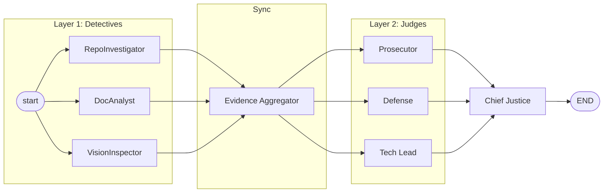

# Automaton Auditor

Deep LangGraph Swarms for Autonomous Governance — Week 2 Challenge

## Overview

The Automaton Auditor is a production-grade, hierarchical multi-agent system that evaluates GitHub repositories and PDF reports through a **Digital Courtroom** architecture: detectives collect forensic evidence in parallel, three judge personas (Prosecutor, Defense, Tech Lead) render dialectical opinions, and a Chief Justice node synthesizes a final verdict with deterministic conflict resolution. Output is an executive-grade audit report (Markdown + JSON).

## Project structure

```
├── pyproject.toml        # Core deps; use uv sync (uv.lock for exact versions)
├── uv.lock               # Lock file for reproducible installs
├── .env.example          # Env template (no secrets); copy to .env
├── src/
│   ├── state.py          # Pydantic models & AgentState (reducers)
│   ├── graph.py          # LangGraph StateGraph (detectives → judges → chief justice)
│   ├── config.py         # Rubric loading, env config, list rubrics
│   ├── paths.py          # Central paths (rubric, audit dirs, reports)
│   ├── nodes/            # detectives, judges, justice
│   ├── tools/            # git, AST, PDF (chunking, query, URL download)
│   └── utils/            # report serialization, context builder, logger
├── rubric/               # Machine-readable rubric JSON (e.g. week2_rubric.json)
├── docs/                 # Architecture and design (e.g. architecture.md)
├── audit/                # Generated reports (report_onself_generated/, etc.)
├── tests/                # Unit and integration tests
├── main.py               # CLI entry point
└── app.py                # Streamlit web UI entry point
```

## Setup

**Prerequisites:** Python 3.10+ and [uv](https://docs.astral.sh/uv/) (`pip install uv` or see [install](https://docs.astral.sh/uv/getting-started/installation/)).

1. **Clone and install (reproducible)**

   ```bash
   git clone <this-repo-url>
   cd TRP1-Challenge-Week-2
   uv sync
   ```

   The project uses `uv.lock` (committed) so `uv sync` installs exact dependency versions. To refresh the lock after changing `pyproject.toml`:

   ```bash
   uv lock
   uv sync
   ```

2. **Environment**

   Copy `.env.example` to `.env` and set at least one of:

   - `OPENAI_API_KEY` — OpenAI (default)
   - `OPENROUTER_API_KEY` — OpenRouter (optional; set `LLM_MODEL` for Claude/Gemini etc.)

   `.env.example` contains only placeholder variable names and no secrets; keep real keys in `.env` (gitignored). The app loads `.env` first; if no API key is found, it falls back to `.env.example`.

3. **Run an audit**

   **CLI:**
   ```bash
   uv run python main.py --repo <repo_url> --pdf <path_or_url>
   ```

   **Streamlit app:** see [Running the Streamlit app](#running-the-streamlit-app) below.

## Reproducible workflow (exact steps)

To get identical dependency versions and run the auditor from a clean state:

| Step | Command | Purpose |
|------|---------|--------|
| 1 | `uv sync` | Install deps from `uv.lock` (no lock: run `uv lock` first) |
| 2 | `cp .env.example .env` (or copy manually) | Create env file from template |
| 3 | Edit `.env` and set `OPENAI_API_KEY` (or OpenRouter) | Provide LLM API key |
| 4 | `uv run python main.py -r <repo_url> -p <pdf_path_or_url>` | Run audit |
| 5 | `uv run pytest` | Run tests (optional: `uv sync --dev` for dev deps) |

For CI or a fresh machine: clone → `uv sync` → set env → `uv run python main.py ...`. No `pip install -r requirements.txt`; all dependencies are declared in `pyproject.toml` and pinned in `uv.lock`.

## Usage

| Action | Command |
|--------|--------|
| **Audit repo only** | `python main.py -r https://github.com/user/repo.git` |
| **Audit PDF only** | `python main.py -p ./report.pdf` or `-p "https://drive.google.com/..."` |
| **Audit repo + PDF** | `python main.py -r https://github.com/user/repo.git -p ./report.pdf` |
| **Audit (PDF URL)** | `python main.py -r https://github.com/user/repo.git -p "https://drive.google.com/..."` |
| **List rubrics** | `python main.py --list-rubrics` |
| **Custom rubric** | `python main.py -r <repo> -p <pdf> --rubric rubric/week2_rubric.json` |
| **Custom output dir** | `python main.py -r <repo> -p <pdf> --output audit/report_onpeer_generated/` |
| **Compare with peer report** | `python main.py -r <repo> -p <pdf> --compare path/to/peer_audit_report.md` |
| **Verbose + tracing** | `python main.py -r <repo> -p <pdf> --verbose --trace` |
| **Web UI (Streamlit)** | `uv run streamlit run app.py` |

- **Repo and PDF are audited explicitly (not together).** Provide at least one of `--repo` or `--pdf`. Repo-only: audits repository dimensions (and diagram in repo). PDF-only: audits PDF report dimensions. Both: audits all dimensions.
- **PDF**: Accepts a local path or an HTTP(S) URL. Google Drive share links are converted to direct-download URLs automatically.
- **Rubric**: Default is `rubric/week2_rubric.json`. Use `--list-rubrics` to see available files.
- **Repository**: The auditor clones the repo and analyzes the **default branch** only (remote HEAD, typically `main` or `master`). No branch option is supported; ensure the branch you want audited is the default on the remote.

## Running the Streamlit app

The web UI runs the same audit pipeline as the CLI. Use it to configure inputs in the sidebar and download the report from the browser.

1. **Install and set environment** (if not already done):
   ```bash
   uv sync
   cp .env.example .env
   # Edit .env and set OPENAI_API_KEY or OPENROUTER_API_KEY
   ```

2. **Start the app** from the project root:
   ```bash
   uv run streamlit run app.py
   ```

3. **Open in browser** — Streamlit prints a local URL (e.g. `http://localhost:8501`). Open it in your browser.

4. **Configure in the sidebar:**
   - **GitHub repository URL** — optional; leave empty for PDF-only audit.
   - **PDF input** — choose "Upload file" or "URL or path", then provide the PDF.
   - **Rubric** — select the rubric file (default: week2).
   - **Output directory** — where reports are saved (default: `audit/report_onself_generated/`).
   - Optionally: upload a peer report for comparison, or enable Verbose logging / LangSmith tracing.

5. **Run the audit** — click **Run audit** in the sidebar. Wait for the spinner to finish.

6. **View and download** — the report appears below. Use **Download report (Markdown)** or **Download report (JSON)** to save it. The report stays visible after download (session state is preserved).

To stop the app: press `Ctrl+C` in the terminal.

## Screenshots

*(Add your screenshots below. Suggested images: Streamlit home/sidebar, audit result with report and download buttons.)*

| Description | Screenshot |
|-------------|------------|
| Streamlit app — configuration sidebar and run audit | *(Insert image: e.g. `docs/screenshots/streamlit-sidebar.png`)* |
| Audit complete — report and download buttons | *(Insert image: e.g. `docs/screenshots/streamlit-report.png`)* |

Example Markdown to replace the placeholders once you have image files:

```markdown
| Streamlit app — configuration sidebar and run audit |  |
| Audit complete — report and download buttons        |    |
```

If you store screenshots in `docs/screenshots/`, create that folder and add the image files there.

## Testing on peer vs by peer

| Scenario | What you do | Where output goes |
|----------|-------------|-------------------|
| **On peer** | You audit a peer’s repo and PDF (you run the auditor on their repo + report). | `--output audit/report_onpeer_generated/` so the report is saved there. |
| **By peer** | A peer has audited your repo and sent you their `audit_report.md`. You want to compare it with your own run. | Put their report in `audit/report_bypeer_received/` (e.g. `peer_audit_report.md`). Run your audit, then pass `--compare audit/report_bypeer_received/peer_audit_report.md` to see score differences and per-criterion diffs. |

**Example — audit a peer’s submission (on peer):**

```bash
python main.py -r https://github.com/peer/their-week2-repo.git -p "https://drive.google.com/..." -o audit/report_onpeer_generated/
```

**Example — compare with a report you received (by peer):**

```bash
# 1. Run your own audit (same repo + PDF)
python main.py -r https://github.com/you/your-repo.git -p ./reports/your_report.pdf -o audit/report_onself_generated/

# 2. Compare with the peer’s report you received
python main.py -r https://github.com/you/your-repo.git -p ./reports/your_report.pdf --compare audit/report_bypeer_received/peer_audit_report.md
```

The second run re-runs the full audit and then prints a comparison (overall score difference, criterion-by-criterion diffs, and issues the peer’s report flagged). To only compare without re-running, use the report parser in code: `from src.utils.report_parser import compare_reports; compare_reports("audit/report_onself_generated/audit_report.md", "audit/report_bypeer_received/peer_audit_report.md")`.

## Architecture

- **Layer 1 — Detectives**: RepoInvestigator (git + AST), DocAnalyst (PDF + cross-ref), VisionInspector (diagrams; optional). Run in parallel; evidence merged via state reducer.
- **Layer 2 — Judges**: Prosecutor, Defense, Tech Lead. Each scores every rubric dimension from their persona; opinions stored as dicts to avoid serialization issues.
- **Layer 3 — Chief Justice**: Hardcoded rules (security override, fact supremacy, functionality weight, dissent when variance > 2). Produces `AuditReport` and remediation plan.

**StateGraph flow (parallel fan-out / fan-in):**



A detailed diagram is in `docs/architecture.md`. Report shows the **original PDF URL** (e.g. Google Drive link), not the temporary download path.

## Output

- **Markdown**: `audit_report.md` — metadata table, score overview, criterion breakdown with judge opinions and remediation.
- **JSON**: `audit_report.json` — same content for tooling.

## Testing

```bash
uv sync --dev
pytest
pytest --cov=src --cov-report=html
pytest tests/unit/
pytest tests/integration/
```

## Troubleshooting

| Issue | What to do |
|-------|------------|
| Rubric not found | Ensure `rubric/week2_rubric.json` exists; use `--rubric` or `--list-rubrics`. |
| No API key | Set `OPENAI_API_KEY` or `OPENROUTER_API_KEY` in `.env` (or `.env.example`). |
| Git clone failed | Check repo URL, network, and that the repo is public or credentials are set. The auditor clones the default branch only. |
| PDF download failed | For Google Drive, use a link shared with “Anyone with the link”. |
| Synthesis failed | Inspect `debug_state.json` in the output dir; use `--trace` and LangSmith. |
| Rate limits | Rate limiter is enabled; wait and retry or adjust `src/utils/rate_limiter.py`. |

## License

Week 2 Challenge — TRP1 Intensive Training
