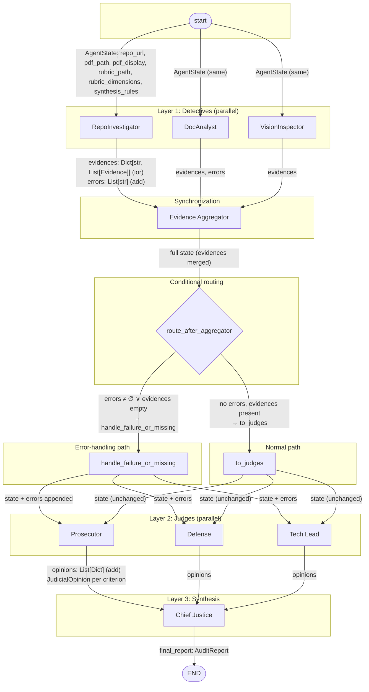
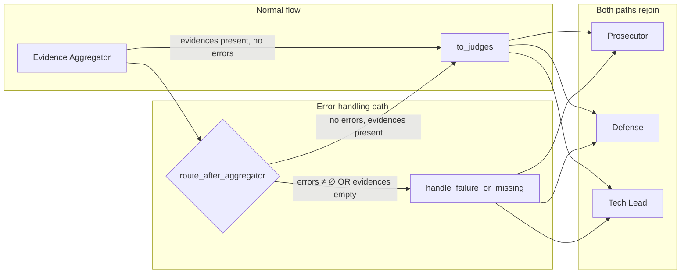

# FDE Challenge Week 2: The Automaton Auditor

**Author:** Mama Mohammed  
**Date:** February 2026  
**Repo:** https://github.com/MamaMoh/TRP1-Challenge-Week-2

---

## 1. Introduction

This report documents the design and implementation of Automaton Auditor, developed for Week 2 of the FDE (Forensic Digital Evaluation) Challenge.

The objective of Week 2 is to transition from managing a single "Silicon Worker" (Week 1) to governance at scale. Instead of building agents that produce artifacts, the challenge focuses on building a system that evaluates artifacts — specifically GitHub repositories and accompanying PDF reports — against a structured rubric.

To meet this objective, the system is designed as a multi-agent evaluation pipeline based on a "Digital Courtroom" architecture. It uses a layered LangGraph StateGraph to orchestrate:

- Forensic evidence gathering by parallel detective agents
- Adversarial judicial reasoning by three distinct judge personas
- Deterministic synthesis by a Chief Justice node into a final audit report

This report covers: challenge context and objectives; system design and architecture; the StateGraph orchestration model (with full diagrams and wiring); project structure; evaluation-criteria alignment; and gap analysis with a forward plan. All explanations and diagrams are included in this document so that the design and behaviour can be understood without opening other files.

---

## 2. The Challenge Context

In an AI-native enterprise, autonomous agents can generate code at a scale that exceeds human review capacity. The bottleneck shifts from production to evaluation.

The challenge is therefore to build an **Automated Auditor Swarm** capable of:

1. **Forensic analysis** — Verifying that claimed artifacts exist and meet structural expectations (e.g. typed state, graph orchestration, safe tool usage). Evidence is collected via tools (git clone, AST parsing, PDF parsing) and recorded as structured objects, not freeform text.
2. **Nuanced judgment** — Applying a complex rubric across multiple dimensions using distinct perspectives. A single "grader" prompt is insufficient; the system uses separate Prosecutor, Defense, and Tech Lead personas so the same evidence is interpreted in adversarial, charitable, and pragmatic ways.
3. **Constructive feedback** — Producing actionable remediation guidance (file-level, criterion-level) rather than a simple pass/fail. The output includes per-criterion scores, judge opinions, dissent summaries when variance is high, and a consolidated remediation plan.

**Inputs:** A GitHub repository URL (the codebase under audit); a PDF report (e.g. architectural description or self-evaluation) — provided as a local path or URL (Google Drive links are supported and converted to direct download).

**Output:** A structured audit report (Markdown and JSON) including: an executive summary and overall score; per-criterion scores with judge opinions (Prosecutor, Defense, Tech Lead) and cited evidence; dissent summaries where score variance between judges exceeds a threshold; a remediation plan (consolidated and per criterion).

**Conceptual framing: Digital Courtroom** — Detectives gather evidence and do not opine; they output structured Evidence objects keyed by rubric dimension. Judges interpret evidence through distinct personas and output structured JudicialOpinion objects (score, argument, cited evidence). A Chief Justice synthesizes the final verdict using deterministic rules (security override, fact supremacy, variance/dissent handling), not another LLM call, so the outcome is auditable and repeatable.

---

## 3. Project Overview

Automaton Auditor is implemented as a LangGraph-based multi-agent orchestration system. It accepts a repository URL and a PDF (local path or URL; Google Drive links supported), loads a machine-readable rubric (default: `rubric/week2_rubric.json`), executes a three-layer evaluation pipeline (detectives → aggregation and conditional routing → judges → Chief Justice), and produces structured audit reports (Markdown and JSON) in a designated directory. Optionally compares the current run's report with a peer report when `--compare <path>` is provided.

### 3.1 Three-Layer Evaluation Pipeline

- **Layer 1 — Detective layer:** RepoInvestigator, DocAnalyst, VisionInspector run in parallel from start; each writes into shared state via reducers (`operator.ior` for evidences).
- **Layer 2 — Judicial layer:** Prosecutor, Defense, Tech Lead run in parallel after evidence aggregation; each scores every rubric dimension with `with_structured_output(JudicialOpinion)`; opinions merged via `operator.add`.
- **Layer 3 — Chief Justice:** Deterministic synthesis (security override, fact supremacy, variance/dissent, functionality weight); produces `AuditReport`; no LLM.

(Detailed node descriptions for detectives and judges are as in the original report; omitted here for length.)

---

## 4. System Execution Flow

Step 1 — CLI invocation (`--repo`, `--pdf`, `--output`, `--rubric`, `--compare`, `--verbose`, `--trace`).  
Step 2 — Setup: PDF resolution (URL/download), rubric load, env config, graph build, initial state.  
Step 3 — Parallel detectives (RepoInvestigator, DocAnalyst, VisionInspector); state merged at Evidence Aggregator.  
Step 4 — Evidence aggregation and conditional routing: `route_after_aggregator` → `to_judges` or `handle_failure_or_missing`; both paths fan out to the three judges.  
Step 5 — Parallel judges (Prosecutor, Defense, Tech Lead); opinions appended to state.  
Step 6 — Chief Justice: group opinions by criterion, apply synthesis rules, build `CriterionResult` and `AuditReport`.  
Step 7 — Output: serialize to Markdown and JSON; optional comparison with peer report.

---

## 5. Project Structure

The repository is organized as in the original report (src/state.py, src/graph.py, src/nodes/detectives.py, judges.py, justice.py, src/tools/, rubric/, audit/, docs/, etc.).

---

## 6. Architecture and StateGraph Design

The system is implemented using a LangGraph StateGraph so that: parallelism is explicit (detective and judge nodes fan out from common sources); state merging is explicit (evidences `operator.ior`, opinions and errors `operator.add`); execution order is deterministic (entry → detectives → evidence_aggregator → conditional → judges → chief_justice → END); conditional routing allows handling "evidence missing" or "node failure" without aborting.

### 6.1 Design Decisions

- **Typed state (TypedDict + Pydantic):** AgentState is TypedDict; Evidence, JudicialOpinion, CriterionResult, AuditReport are Pydantic. Reducers required for parallel merge.
- **Three detectives:** RepoInvestigator (code/repo), DocAnalyst (PDF/cross-reference), VisionInspector (diagram); clear forensic roles and parallel execution.
- **Three judges + Chief Justice:** Distinct personas (adversarial, charitable, pragmatic); Chief Justice is pure Python rules, not LLM.
- **Conditional edges:** `route_after_aggregator` → `to_judges` or `handle_failure_or_missing`; degradation path still leads to judges so the report can state audit degradation.
- **Sandboxing for repo clone:** All git clones use a temp directory (never cwd), `subprocess.run` with list args (no shell), URL validation, timeout, and post-clone git check (see Section 7.1 for full rationale, alternatives, and trade-offs).

Section 7.1 elaborates on why these choices were made over alternatives and the trade-offs involved.

### 6.2 High-Level Flow (text diagram)

```
start → [RepoInvestigator | DocAnalyst | VisionInspector] (parallel)
      → evidence_aggregator (fan-in)
      → route_after_aggregator → to_judges OR handle_failure_or_missing
      → [Prosecutor | Defense | Tech Lead] (parallel)
      → chief_justice → END
```

### 6.3 Fan-Out / Fan-In and Conditional Edges

- **Fan-out:** From start → three Detectives; from post-aggregator path → three Judges.  
- **Fan-in:** All Detectives → Evidence Aggregator; all Judges → Chief Justice.  
- **Conditional:** After Evidence Aggregator, `route_after_aggregator(state)` chooses `to_judges` (no errors, evidences present) or `handle_failure_or_missing` (errors or empty evidences). Both branches then fan out to the same three judge nodes.

### 6.4 StateGraph Diagrams (with state types on edges and conditional/error paths)

The following diagrams visually represent **state types or data labels on the edges** and **explicit conditional edges and error-handling paths** as required by the rubric.

#### Diagram 1: Full flow with state types on every edge

Every edge is labeled with the **AgentState** keys (and types where helpful) that flow along it. The conditional node and the two outgoing branches (normal vs error path) are explicitly shown.



- **Edge labels:** Each edge shows the AgentState keys (and reducer/type where relevant) that flow on that edge. Reducers: `evidences` use `operator.ior` (dict merge); `opinions` and `errors` use `operator.add` (list append).
- **Conditional node:** `route_after_aggregator` has two outgoing edges: one to **handle_failure_or_missing** (error path) when `errors` non-empty or `evidences` empty; one to **to_judges** (normal path) otherwise.
- **Error-handling path:** The branch into `handle_failure_or_missing` is the explicit error path; that node only appends a degradation message to `errors` and does not change evidence; both paths then feed the same three judge nodes.

#### Diagram 2: Conditional and error-handling path highlighted

This diagram emphasizes the **conditional edges** and the **error-handling path** so that they are visually distinct from the normal flow.



- **Conditional edges:** The diamond `route_after_aggregator` has two outcomes: (1) **Error path:** when there are errors or no evidence → `handle_failure_or_missing`, which appends a degradation message to `state.errors`. (2) **Normal path:** when evidence exists and no errors → `to_judges` (passthrough). Both paths then fan out to Prosecutor, Defense, and Tech Lead so that the judicial layer and Chief Justice always run, and the report can record a degraded audit when applicable.

#### Diagram 3: State types summary (AgentState schema on edges)

| Edge / segment | State keys and types flowing |
|----------------|-------------------------------|
| start → Detectives | `repo_url`, `pdf_path`, `pdf_display`, `rubric_path`, `rubric_dimensions`, `synthesis_rules` (inputs; no reducers) |
| Detectives → Evidence Aggregator | `evidences: Dict[str, List[Evidence]]` (reducer: `operator.ior`), `errors: List[str]` (reducer: `operator.add`) |
| Evidence Aggregator → conditional | Full merged state (evidences, errors, plus all inputs) |
| Conditional → to_judges | Full state (unchanged) |
| Conditional → handle_failure_or_missing | Full state; node returns `{"errors": state.errors + [degradation_msg]}` |
| to_judges / handle_failure_or_missing → Judges | Full state (including any appended errors) |
| Judges → Chief Justice | `opinions: List[Dict]` (reducer: `operator.add`; each dict is JudicialOpinion.model_dump()) |
| Chief Justice → END | `final_report: AuditReport` |

These three elements (Diagram 1, Diagram 2, and the state-types table) together provide: (1) state types or data labels on the edges, and (2) explicit representation of conditional edges and error-handling paths.

### 6.5 Graph Wiring (nodes and edges as in code)

```
workflow = StateGraph(AgentState)
workflow.add_node("start", start_node)
workflow.add_node("repo_investigator", repo_investigator_node)
workflow.add_node("doc_analyst", doc_analyst_node)
workflow.add_node("vision_inspector", vision_inspector_node)
workflow.add_node("evidence_aggregator", evidence_aggregator_node)
workflow.add_node("to_judges", to_judges_node)
workflow.add_node("handle_failure_or_missing", handle_failure_or_missing_node)
workflow.add_node("prosecutor", prosecutor_node)
workflow.add_node("defense", defense_node)
workflow.add_node("tech_lead", tech_lead_node)
workflow.add_node("chief_justice", chief_justice_node)

workflow.set_entry_point("start")
workflow.add_edge("start", "repo_investigator")
workflow.add_edge("start", "doc_analyst")
workflow.add_edge("start", "vision_inspector")
workflow.add_edge("repo_investigator", "evidence_aggregator")
workflow.add_edge("doc_analyst", "evidence_aggregator")
workflow.add_edge("vision_inspector", "evidence_aggregator")
workflow.add_conditional_edges("evidence_aggregator", route_after_aggregator,
    path_map={"to_judges": "to_judges", "handle_failure_or_missing": "handle_failure_or_missing"})
workflow.add_edge("to_judges", "prosecutor")
workflow.add_edge("to_judges", "defense")
workflow.add_edge("to_judges", "tech_lead")
workflow.add_edge("handle_failure_or_missing", "prosecutor")
workflow.add_edge("handle_failure_or_missing", "defense")
workflow.add_edge("handle_failure_or_missing", "tech_lead")
workflow.add_edge("prosecutor", "chief_justice")
workflow.add_edge("defense", "chief_justice")
workflow.add_edge("tech_lead", "chief_justice")
workflow.add_edge("chief_justice", END)
```

---

## 7. Evaluation Criteria Alignment

### 7.1 Architecture Decision Rationale

The following explains why specific choices were made, what alternatives were considered, and what trade-offs were accepted.

#### Hierarchical StateGraph

- **Choice:** A LangGraph `StateGraph` with explicit nodes (start, detectives, evidence_aggregator, conditional, judges, chief_justice) and edges defining fan-out, fan-in, and conditional routing.
- **Alternatives considered:** (1) A linear script that runs detectives sequentially then judges sequentially — simpler to read but no explicit parallelism and no clear place to attach conditional logic. (2) A single “super-agent” that uses tools for git, PDF, and diagram checks — fewer moving parts but all evidence and control flow in one prompt; state merging and error handling become implicit and harder to audit. (3) A DAG in another framework (e.g. Prefect, Airflow) — would give parallelism and conditioning but would require a different state model and would not align with the rubric’s LangGraph expectation.
- **Trade-offs:** The graph is more complex than a linear script and requires understanding of reducers and conditional edges. In return, parallelism is explicit (runtime can execute detectives and judges in parallel), state flow is visible in the diagram, and conditional routing (e.g. evidence missing) is a first-class construct. We accepted the added complexity to satisfy the rubric’s requirement for explicit fan-out/fan-in and conditional edges and to keep the pipeline auditable.

#### Typed state (TypedDict + Pydantic)

- **Choice:** Top-level graph state is a `TypedDict` (`AgentState`); nested values use Pydantic models (`Evidence`, `JudicialOpinion`, `CriterionResult`, `AuditReport`). Reducers (`operator.ior` for evidences, `operator.add` for opinions and errors) are annotated on the state keys that receive parallel updates.
- **Alternatives considered:** (1) Plain `dict` for state — minimal boilerplate but no type checking or schema validation; LangGraph’s reducer semantics would be undocumented. (2) A single Pydantic `BaseModel` for the whole state — would give validation and schema but LangGraph expects partial updates; merging parallel updates into one model is awkward and would require custom reducers for every key. (3) Dataclasses for nested types — lighter than Pydantic but no `with_structured_output` integration or JSON schema for LLM outputs.
- **Trade-offs:** TypedDict does not validate at runtime (only static typing); we rely on nodes to write the correct keys. Pydantic adds dependency and serialization rules (e.g. opinions stored as `model_dump()` dicts in state to avoid LangGraph serialization issues). We accepted these to get clear contracts, reducer support for parallel merge, and structured LLM outputs via Pydantic-bound schemas.

#### Three detectives

- **Choice:** Three separate nodes — RepoInvestigator (code/repo, AST, git), DocAnalyst (PDF, cross-reference), VisionInspector (diagram detection) — each writing into shared state with `operator.ior` (evidences).
- **Alternatives considered:** (1) One detective node that runs all forensic steps in sequence — only one node to maintain and no reducer complexity, but no parallelism and a single point of failure; also mixes concerns (repo, PDF, diagram) in one place. (2) One detective that calls multiple tools in a loop — similar to (1); tool outputs would still need to be merged into state by hand. (3) More than three detectives (e.g. separate node for git history) — finer granularity but more edges and more reducer keys; the rubric’s “three detectives” and “parallel” expectations are satisfied with three.
- **Trade-offs:** Three nodes mean three separate repo clones when both RepoInvestigator and DocAnalyst (and VisionInspector) need the repo; we accepted duplicate clone work for clearer separation of roles and independent parallelism. Consolidating to a single “repo fetcher” that runs before the three would require a graph change (e.g. a fourth node that runs first and writes repo path or file list into state); that is a possible future improvement.

#### Three judges + Chief Justice

- **Choice:** Three judge nodes (Prosecutor, Defense, Tech Lead) and one Chief Justice node that applies deterministic rules (security override, fact supremacy, variance/dissent, functionality weight); no LLM in Chief Justice.
- **Alternatives considered:** (1) Single “grader” LLM that scores all criteria — one LLM call per rubric dimension, lower cost and simpler, but no dialectical tension or rubric-required “distinct perspectives”; single point of bias. (2) Two judges (e.g. Prosecutor and Defense only) — less cost than three but Tech Lead acts as tie-breaker and pragmatic lens; dropping it would make tie-breaking more arbitrary. (3) Chief Justice as another LLM that “synthesizes” the three opinions — would allow natural-language summaries but the verdict would be non-deterministic and harder to audit; the rubric asks for deterministic synthesis.
- **Trade-offs:** Three judges multiply LLM calls (3 × number of dimensions). We accepted the cost to get adversarial vs charitable vs pragmatic viewpoints and to satisfy the rubric. The Chief Justice is pure Python so the final score is reproducible and explainable; we gave up flexible summary text from an LLM for auditability.

#### Conditional edges

- **Choice:** After the evidence aggregator, a conditional edge routes to `to_judges` (no errors, evidences present) or `handle_failure_or_missing` (errors or empty evidences); both paths then fan out to the same three judges.
- **Alternatives considered:** (1) No branch — on any detective error or missing evidence, abort the run and return an error message. Simpler but the rubric explicitly requires handling “Evidence Missing or Node Failure” without aborting; we would not produce a report. (2) Branch only on “hard” failure (e.g. exception) but not on “empty evidence” — would allow partial reports when one detective fails, but “evidence missing” is a distinct case the rubric calls out. (3) Multiple branches (e.g. different paths for “missing evidence” vs “node failure”) — both paths currently do the same thing (append a message to `errors` and proceed to judges); we could split later if we wanted different messaging or behaviour.
- **Trade-offs:** The conditional adds a routing function and two target nodes (`to_judges` is a passthrough). We accepted the extra complexity so the pipeline always reaches the judicial layer and the report can explicitly state that the audit was degraded when evidence was missing or a node failed.

#### Sandboxing strategy for cloning unknown repositories

The auditor accepts an arbitrary GitHub repository URL. Cloning must be safe against malicious or malformed URLs and must not affect the host’s working directory or other assets.

- **Choice:** (1) **Isolated directory:** All clones go into a temporary directory created with `tempfile.TemporaryDirectory()` (or `tempfile.mkdtemp()` when the caller passes a parent dir). The implementation never uses the process current working directory as the clone target. If the caller passes `target_dir` equal to `os.getcwd()`, `_ensure_sandbox_dir()` in `src/tools/git_tools.py` detects this and forces a temp dir instead, so we never clone into the live project. (2) **No shell:** `git clone` is invoked via `subprocess.run(["git", "clone", repo_url, repo_path], ...)` with a list of arguments; no `shell=True` and no string interpolation of the URL into a shell command, which would expose us to injection. (3) **URL validation:** The repo URL is validated with a strict pattern (`REPO_URL_PATTERN`): only `https?://` or `git@host:path` forms are allowed; `file://`, spaces, newlines, and characters like `;`, `|` are rejected before any subprocess call. (4) **Timeout and errors:** Clone runs with `timeout=120`; `CalledProcessError` and `TimeoutExpired` are caught and turned into a `RuntimeError` with a classified message (auth, not found, network, etc.). (5) **Post-clone check:** After clone, we verify the path is a valid git repo (e.g. `.git` exists); if not, we raise rather than returning a non-git directory.
- **Alternatives considered:** (1) Clone into a fixed subdirectory under the project (e.g. `./audit/cloned_repos/`) — would allow reuse across runs but would persist possibly malicious repo content and could mix runs; temp dirs are deleted when the context exits. (2) Use `git clone --depth 1` only — would reduce disk and time but the rubric’s git-forensic dimension expects history (e.g. commit progression); we use a full clone. (3) Run clone in a container or VM — strongest isolation but adds operational cost and is not required for the current threat model (untrusted URL and payload, not untrusted code execution from the cloned repo).
- **Trade-offs:** Each detective that needs the repo (RepoInvestigator, DocAnalyst, VisionInspector) currently performs its own clone inside a `with tempfile.TemporaryDirectory() as tmpdir` block, so we clone the same repo up to three times per run. We accepted duplicate clone work for simplicity and to keep detectives independent and parallel; a future improvement is a shared “repo fetcher” node that clones once and writes the path (or file list) into state. Sandboxing is process-local (temp dir + no shell); we do not run cloned code, so we rely on the OS and filesystem for isolation rather than a sandboxed execution environment.

This rationale is implemented in the codebase and is fully explained in Sections 3, 4, and 6 of this report.

### 7.2 Gap Analysis and Forward Plan

#### Resolved gaps (already addressed)

- **Report accuracy (cross-reference):** DocAnalyst now calls `get_repo_file_list(repo_url)` and passes it to `verify_file_claims`; paths normalized; verified vs hallucinated counts based on real repo contents.  
- **Safe tool engineering (false positive):** AST-based check counts only actual `os.system` call nodes, not string literals or comments.  
- **Structured output (forensic detection):** Uses Pydantic is true when `with_structured_output` and `JudicialOpinion` appear, even if "Pydantic" is not in the judges file.  
- **Judicial and Chief Justice evidence depth:** Snippet lengths for judges.py and justice.py (and graph structure) increased so persona prompts, judicial logic, and Chief Justice rules are visible to judges.  
- **Architectural diagram criterion:** VisionInspector clones repo and checks `docs/architecture.md` and README for Mermaid (flowchart, graph, stateDiagram); repo includes architecture diagram.

#### Forward plan for *unbuilt* components (judicial layer and synthesis engine)

The following focuses on what is **not yet built** for the judicial layer and the synthesis engine, with **specific tasks**, **sequencing**, and **anticipated failure modes**.

---

**A. Judicial layer — unbuilt components**

| # | Unbuilt component | Description | Specific tasks | Sequencing | Anticipated failure modes |
|---|--------------------|-------------|----------------|------------|---------------------------|
| A1 | **Evidence-citation validation** | Judges return `cited_evidence` (e.g. UUIDs or keys); the system does not verify that these IDs exist in `state.evidences` before or after synthesis. | (1) Add a validation step in each judge node or in a post-judge step: resolve each `cited_evidence` entry against `state.evidences` and mark invalid/missing refs. (2) Optionally pass validation result (e.g. count of valid vs invalid citations) into Chief Justice or into the report (e.g. "Judge X cited 2 evidence IDs not found in state"). (3) Add rubric dimension or synthesis rule: "If a judge cites non-existent evidence, discount or flag that opinion." | After judges return opinions, before Chief Justice. Validation can run in a small node that reads `state.evidences` and `state.opinions` and appends a `citation_validation` map to state. | Judges may cite UUIDs from a different run or typo IDs; validation returns "all invalid" and could wrongly penalize. Mitigation: normalize evidence IDs (e.g. criterion_id + index) and document ID format in prompts. |
| A2 | **Judge timeout / partial failure** | If one judge (e.g. Prosecutor) times out or raises, the graph may still merge partial opinions; Chief Justice currently assumes exactly three opinions per criterion. | (1) Define contract: each judge returns a list of opinions (one per dimension); on timeout/exception, return empty list or a single "error" opinion with score=1 and argument="Evaluation failed (timeout/error)." (2) In Chief Justice, handle missing opinions per criterion: if fewer than three, apply rule (e.g. use only available opinions, or set final_score=1 with dissent "Missing judge N"). (3) Add state key `judge_errors: List[str]` and append "Prosecutor timed out" so the report can state partial evaluation. | Implement when adding retry/timeout in judge invocation (see A3). Chief Justice change must follow the new contract. | If two judges timeout, final score may rely on one judge only; report could be misleading. Mitigation: require at least two opinions per criterion for a valid score; otherwise mark criterion as "Inconclusive." |
| A3 | **Retry and fallback for judge LLM failures** | Today there is retry for structured-output parse failures; there is no timeout or fallback when the LLM never returns (e.g. API hang). | (1) Wrap judge LLM invoke in a timeout (e.g. `asyncio.wait_for` or thread with timeout). (2) On timeout, append to `judge_errors` and push a single JudicialOpinion per dimension with score=1, argument="Judge evaluation timed out." (3) Optionally: fallback to a lighter model or cached "neutral" opinion for that criterion so Chief Justice always has three opinions. | Can be done in parallel with A2; A2 consumes the new behaviour. | Timeout too short may increase false "timeout" opinions; too long may block the run. Mitigation: make timeout configurable (e.g. from rubric or env) and log timeouts for tuning. |
| A4 | **Rubric-driven persona weighting** | Synthesis rules are hardcoded (e.g. "Tech Lead breaks tie"). The rubric's `synthesis_rules` (e.g. `functionality_weight`, `dissent_requirement`) are not read and applied as parameters (e.g. which judge has tie-break for which dimension type). | (1) Parse `synthesis_rules` from rubric into a small schema (e.g. which dimension types use which tie-breaker, variance threshold). (2) In Chief Justice, use these parameters when applying rules (e.g. for "graph_orchestration" use Tech Lead weight from rubric). (3) Unit test with two different rubrics to ensure behaviour changes with rubric. | After current Chief Justice logic is stable; requires rubric schema extension or convention (e.g. keys like `tie_breaker_architecture`). | Malformed or missing rubric keys could fall back to current hardcoded behaviour; document default and validate rubric at load. |
| A5 | **Persona calibration / drift detection** | No mechanism to detect if the three judges collapse to similar scores (persona drift) or if one judge systematically disagrees with evidence. | (1) After each run, compute per-criterion variance and mean score; log or store in report metadata. (2) Optional: if variance is below a threshold for all criteria, add a report note "Low variance: consider reviewing persona prompts for distinctness." (3) Optional: compare cited_evidence overlap between Prosecutor and Defense to detect collusion. | Post-run analysis; can be a separate script or a final node that amends report metadata. | May add noise if rubrics are simple and evidence is clear; make the note optional and threshold configurable. |

---

**B. Synthesis engine — unbuilt components**

| # | Unbuilt component | Description | Specific tasks | Sequencing | Anticipated failure modes |
|---|--------------------|-------------|----------------|------------|---------------------------|
| B1 | **Rubric-driven synthesis parameters** | Variance threshold (e.g. 2) and security cap (e.g. 3) are hardcoded in Chief Justice. Rubric already has `synthesis_rules` (e.g. `variance_re_evaluation`, `security_override`) but no numeric parameters. | (1) Extend rubric schema or convention: e.g. `variance_threshold: 2`, `security_cap_score: 3`, `dissent_variance_min: 2`. (2) Load these in Chief Justice (from state or rubric); use in conditionals (e.g. `if score_variance > variance_threshold`). (3) If rubric omits them, use current defaults and document. | After A4 if both use rubric; otherwise independent. | Wrong or extreme values (e.g. variance_threshold=0) could force dissent on every criterion; validate and clamp to sane ranges. |
| B2 | **Remediation text beyond Tech Lead copy** | Remediation is currently the Tech Lead argument string (and optional suffix when score < 3). There is no structured, file-level or criterion-level remediation generated from all three opinions. | (1) Define a small RemediationStep model (e.g. file path, suggested change, source judge/criterion). (2) In Chief Justice, for criteria with final_score < 3, optionally invoke a dedicated "remediation summarizer" (LLM or rule-based) that takes Prosecutor, Defense, and Tech Lead arguments and produces a short, ordered list of steps. (3) If LLM: keep it optional and behind a flag so deterministic report path remains default. | After Chief Justice outputs CriterionResult; can be a second pass over criteria_results. | LLM-based remediation could hallucinate file paths; prefer rule-based extraction (e.g. "add reducer" from Prosecutor argument) or restrict LLM to summarization only. |
| B3 | **Executive summary enrichment** | Executive summary is template-built (scores, counts). No narrative nuance (e.g. "Strong in state management; weak in report accuracy"). | (1) Option A: Add an optional LLM pass that takes executive_summary + criteria_results and returns 2–3 sentence narrative; append to report. Option B: Rule-based: "Strengths: criteria with score ≥ 4; Weaknesses: criteria with score < 3" and list dimension names. (2) Keep current template as fallback if enrichment is disabled or fails. | Post Chief Justice; can run before or after B2. | LLM narrative could contradict scores; use as supplement only and keep template summary as canonical. |
| B4 | **Dissent summary enrichment** | Dissent summary is built from truncated Prosecutor/Defense arguments and resolution rationale. No structured "conflict type" (e.g. evidence vs interpretation) or link to synthesis rule applied. | (1) In Chief Justice, when building dissent_summary, append the name of the rule that resolved the tie (e.g. "fact_supremacy", "tech_lead_tie_breaker"). (2) Optionally classify dissent (e.g. "evidence_quality" vs "interpretation") from keywords in arguments. (3) Expose in report so readers see which synthesis rule was used. | Can be done inside current Chief Justice loop when variance > 2. | Classification might be wrong; keep it optional and descriptive only. |
| B5 | **Export to other formats** | Report is Markdown and JSON only. No HTML, PDF, or schema-validated JSON (e.g. JSON Schema) for downstream tools. | (1) Add serializer for HTML (e.g. Jinja2 template or Markdown-to-HTML). (2) Optionally add PDF export (e.g. weasyprint or reportlab). (3) Publish JSON Schema for audit_report.json and validate before write. | Independent; can be parallel to other items. | PDF/HTML may have styling or encoding issues; validate on multiple samples. |

---

**C. Sequencing and dependencies**

1. **Phase 1 (robustness):** A2 (missing-opinion handling) and A3 (timeout/fallback) so the pipeline tolerates judge failures.  
2. **Phase 2 (correctness):** A1 (citation validation) and B4 (dissent enrichment) so the report reflects real evidence and applied rules.  
3. **Phase 3 (configurability):** A4 (rubric-driven persona weighting) and B1 (rubric-driven synthesis parameters) so behaviour is driven by rubric.  
4. **Phase 4 (quality):** B2 (remediation), B3 (executive summary), A5 (persona drift) as optional enhancements.  
5. **Phase 5 (output):** B5 (export formats) as needed.

This forward plan addresses the rubric feedback that the plan for *unbuilt* judicial and synthesis components should be more granular, with specific tasks, sequencing, and anticipated failure modes.

---

## 8. Conclusion

Automaton Auditor implements the Week 2 challenge through a structured, multi-agent "Digital Courtroom" architecture. The system collects forensic evidence in parallel via RepoInvestigator, DocAnalyst, and VisionInspector; applies adversarial judicial reasoning via Prosecutor, Defense, and Tech Lead with Pydantic-bound JudicialOpinion output; and enforces deterministic synthesis in the Chief Justice node using hardcoded rules, producing a single AuditReport. It produces traceable, auditable reports in Markdown and JSON, with optional comparison to a peer report.

The architecture is explicitly modeled as a LangGraph StateGraph with clear parallelism, safe state merging (operator.ior, operator.add), and conditional routing for robustness. This report contains the full rationale, execution flow, project structure, **StateGraph diagrams with state types on edges and explicit conditional/error-handling paths**, and an **expanded gap analysis and forward plan for unbuilt judicial and synthesis components** (specific tasks, sequencing, and failure modes). The submission includes source code, machine-readable rubric, architecture diagrams (in this report and in the repo), structured reports, tests, and the gap analysis and forward plan described in Section 7.2.
