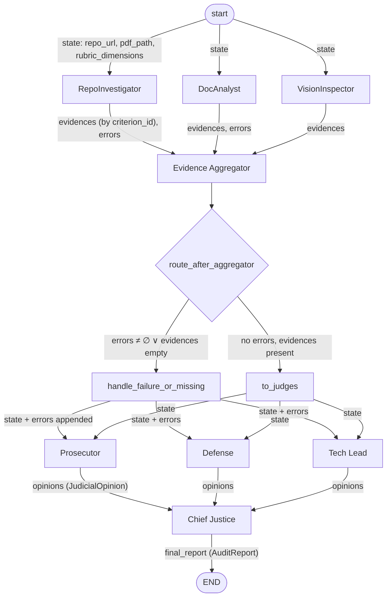
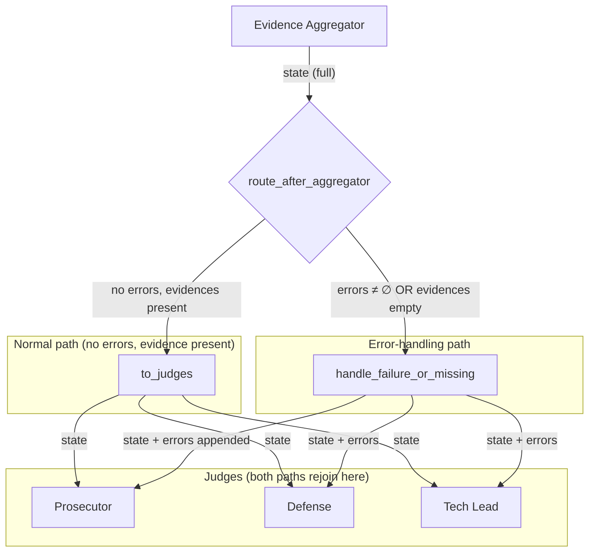

# FDE Challenge Week 2: The Automaton Auditor — Final Report

**Author:** Mama Mohammed  
**Date:** February 2026  
**Repo:** https://github.com/MamaMoh/TRP1-Challenge-Week-2

---

## Executive Summary

**1. Scope and architectural approach.** This report documents the design and implementation of **Automaton Auditor**, a multi-agent evaluation system built for Week 2 of the FDE (Forensic Digital Evaluation) Challenge. The system’s purpose is **governance at scale**: instead of producing artifacts, it **evaluates** GitHub repositories and PDF reports against a structured rubric. The architectural approach is a **Digital Courtroom**: three detective agents (RepoInvestigator, DocAnalyst, VisionInspector) gather forensic evidence in parallel; three judge personas (Prosecutor, Defense, Tech Lead) apply adversarial reasoning with Pydantic-bound structured output; a deterministic Chief Justice node synthesizes the final verdict using hardcoded rules (security override, fact supremacy, variance/dissent). The pipeline is implemented as a LangGraph StateGraph with explicit fan-out, fan-in, and conditional routing.

**2. Outcome reporting.** The system was run against its own repository (https://github.com/MamaMoh/TRP1-Challenge-Week-2). **Overall self-audit score: 4.50 / 5.0** across 8 rubric criteria. Six criteria scored 5/5 (Git Forensic Analysis, State Management Rigor, Graph Orchestration Architecture, Safe Tool Engineering, Structured Output Enforcement, Chief Justice Synthesis Engine). Three criteria scored 3/5: Judicial Nuance and Dialectics, Architectural Diagram Analysis, and Safe Tool Engineering (the latter capped by security-override rule despite higher Defense/Tech Lead scores).

**3. Key takeaways from the feedback loop and remaining gaps.** The MinMax feedback loop (Prosecutor vs Defense variance) surfaced meaningful dissent on several criteria; the Chief Justice applied tie-breaker and security-cap rules as designed. **Key findings:** (a) Security override correctly capped Safe Tool Engineering at 3 when evidence was vague; (b) fact supremacy led the Chief Justice to side with evidence-based (Tech Lead) scores where the Defense argued for higher scores; (c) Judicial Nuance scored 3/5 because prompt distinctness and persona execution were questioned; (d) Architectural Diagram scored 3/5 because the diagram in the repo was judged not to clearly show parallel fan-out/fan-in. **Remaining gaps:** remediation text is still largely Tech Lead argument copy; citation validation (judges’ cited evidence IDs vs. state) is not yet implemented; judge timeout and missing-opinion handling are not yet implemented.

**4. Actionability for a senior engineer.** A reader of this section can conclude: the pipeline is implemented and produces structured reports; the self-audit shows strong performance on core infrastructure (state, graph, structured output, Chief Justice) and specific gaps on Safe Tool evidence depth, Judicial Nuance implementation visibility, and diagram clarity. **Immediate next steps:** (1) Add or refine the Mermaid architecture diagram so VisionInspector can detect it and it clearly shows parallel structure; (2) enrich Safe Tool evidence in RepoInvestigator (error types, validation, timeout) and in the report; (3) implement judge timeout and missing-opinion handling in the Chief Justice. The full remediation plan with phased actions is in Section 10.

---

## 1. Introduction

This report covers the challenge context and objectives, system design and architecture, the StateGraph orchestration model (with diagrams and wiring), project structure, evaluation-criteria alignment, **architecture deep dive and diagrams**, **self-audit criterion breakdown**, **MinMax feedback-loop reflection**, and a consolidated **remediation plan**. All explanations and diagrams are in this document so the design and behaviour can be understood without opening other files.

---

## 2. The Challenge Context

In an AI-native enterprise, autonomous agents can generate code at a scale that exceeds human review capacity. The bottleneck shifts from production to evaluation.

The challenge is to build an **Automated Auditor Swarm** capable of:

1. **Forensic analysis** — Verifying that claimed artifacts exist and meet structural expectations (typed state, graph orchestration, safe tool usage). Evidence is collected via tools (git clone, AST parsing, PDF parsing) and recorded as structured objects.
2. **Nuanced judgment** — Applying a complex rubric across dimensions using distinct perspectives: Prosecutor (adversarial), Defense (charitable), Tech Lead (pragmatic).
3. **Constructive feedback** — Producing actionable remediation (file-level, criterion-level), not just pass/fail.

**Inputs:** GitHub repository URL; PDF report (local path or URL; Google Drive supported).  
**Output:** Structured audit report (Markdown + JSON): executive summary, overall score, per-criterion scores with judge opinions and cited evidence, dissent summaries where variance > threshold, and a consolidated remediation plan.

**Conceptual framing — Digital Courtroom:** Detectives gather evidence (structured Evidence objects); Judges interpret via personas (JudicialOpinion); Chief Justice synthesizes with deterministic rules (security override, fact supremacy, variance/dissent), not an LLM.

---

## 3. Project Overview

Automaton Auditor is a LangGraph-based multi-agent system that:

- Accepts a repository URL and a PDF (local or URL).
- Loads a machine-readable rubric (default: `rubric/week2_rubric.json`).
- Runs a three-layer pipeline: **detectives → evidence aggregation + conditional routing → judges → Chief Justice**.
- Produces audit reports in a designated directory (e.g. `audit/report_onself_generated/`).
- Optionally compares the current run with a peer report via `--compare <path>`.

### 3.1 Three-Layer Evaluation Pipeline

**Layer 1 — Detective layer (parallel):** RepoInvestigator (clone, AST, git history, safe tools, structured output), DocAnalyst (PDF parsing, keyword search, cross-reference of file paths), VisionInspector (architecture diagram detection in repo). All write into shared state via `operator.ior` (evidences).

**Layer 2 — Judicial layer (parallel):** Prosecutor, Defense, Tech Lead score each rubric dimension from fixed personas; output is `with_structured_output(JudicialOpinion)`; opinions merged via `operator.add`.

**Layer 3 — Chief Justice (deterministic):** No LLM. Groups opinions by dimension; applies security override, fact supremacy, functionality weight, variance/dissent rules; builds CriterionResult and AuditReport; returns structured report.

---

## 4. System Execution Flow

1. **CLI:** `python main.py --repo <url> --pdf <path_or_url>` with optional `--output`, `--rubric`, `--compare`, `--verbose`, `--trace`.
2. **Setup:** PDF resolved (download if URL; Google Drive → direct link); rubric loaded; StateGraph built; initial state set.
3. **Parallel detectives:** start → RepoInvestigator | DocAnalyst | VisionInspector → evidence_aggregator (fan-in).
4. **Conditional routing:** `route_after_aggregator` → `to_judges` (no errors, evidence present) or `handle_failure_or_missing` (errors or empty evidence); both paths then fan out to the three judges.
5. **Parallel judges:** Prosecutor, Defense, Tech Lead each score all dimensions; opinions appended to state.
6. **Chief Justice:** Synthesizes final scores, dissent summaries, remediation; returns AuditReport.
7. **Output:** Serialize to Markdown and JSON; optional comparison with peer report.

---

## 5. Project Structure

```
├── pyproject.toml, uv.lock, .env.example
├── main.py                 # CLI entry
├── app.py                  # Streamlit UI
├── src/
│   ├── state.py            # AgentState (TypedDict), Evidence, JudicialOpinion, AuditReport (Pydantic)
│   ├── graph.py            # StateGraph build (nodes, edges, conditional)
│   ├── config.py, paths.py
│   ├── nodes/              # detectives.py, judges.py, justice.py
│   ├── tools/              # git_tools, ast_parser, pdf (chunking, URL download)
│   └── utils/              # report serialization, context builder
├── rubric/week2_rubric.json
├── docs/
├── audit/                  # report_onself_generated/, report_onpeer_generated/
└── tests/
```

### 5.1 Running the application (CLI and Streamlit UI)

Automaton Auditor can be run from the command line or via a Streamlit web UI.

**Command-line interface (CLI)**

From the project root:

```bash
# Install dependencies (if not already done)
uv sync

# Run an audit: repository URL + path or URL to PDF report
uv run python main.py --repo <github_repo_url> --pdf <path_or_url_to_pdf>

# Optional: custom output directory, rubric path, compare with peer report
uv run python main.py --repo <url> --pdf <path> --output audit/my_run --rubric rubric/week2_rubric.json --compare audit/peer_report/audit_report.json

# Verbose and LangSmith tracing
uv run python main.py --repo <url> --pdf <path> --verbose --trace
```

**Streamlit UI**

Start the web interface:

```bash
uv run streamlit run app.py
```

Then open the URL shown in the terminal (typically `http://localhost:8501`). In the UI you can:

- Enter a GitHub repository URL and either upload a PDF or provide a URL to a PDF report.
- Optionally set the output directory and rubric path.
- Run the audit and view the resulting report (Markdown/JSON) or compare with a previous run.

**Screenshots**

*Placeholder for UI screenshots. Add images here to show:*

1. **Figure 1 — Streamlit UI (input form):** Screenshot of the Streamlit app with the form for repository URL, PDF input (file upload or URL), and run button.  
   - *How to capture:* Run `uv run streamlit run app.py`, fill the form, then take a screenshot. Save as e.g. `docs/screenshots/streamlit_input.png` and reference below.

2. **Figure 2 — Streamlit UI (audit result):** Screenshot of the audit report rendered in the UI after a run (e.g. executive summary and/or criterion breakdown).  
   - *How to capture:* After an audit completes, scroll to show the report section and capture. Save as e.g. `docs/screenshots/streamlit_report.png`.

3. **Figure 3 — CLI run (optional):** Terminal output showing `python main.py --repo ... --pdf ...` and the first lines of output.  
   - *How to capture:* Run the CLI command, then capture the terminal. Save as e.g. `docs/screenshots/cli_run.png`.

To include the images in this report, add them under this subsection using:

```markdown


```

Create a `docs/screenshots/` folder and place the image files there. The figures will then render when viewing the report in a Markdown viewer or when the doc is exported.

---

## 6. Architecture Deep Dive and Diagrams

The system uses a LangGraph **StateGraph** so that parallelism, state merging, and conditional routing are explicit and auditable.

### 6.1 Design Decisions (summary)

- **Hierarchical StateGraph:** Explicit nodes and edges; fan-out (detectives, judges), fan-in (evidence_aggregator, chief_justice), conditional after aggregator.
- **Typed state:** AgentState (TypedDict); Evidence, JudicialOpinion, CriterionResult, AuditReport (Pydantic). Reducers: `evidences` → `operator.ior`; `opinions`, `errors` → `operator.add`.
- **Three detectives / Three judges + Chief Justice:** Clear forensic roles; distinct judicial personas; Chief Justice is pure Python.
- **Conditional edges:** After evidence_aggregator, route to `to_judges` or `handle_failure_or_missing`; both feed the same three judges so a degraded report can still be produced.
- **Sandboxing:** Clone in `tempfile.TemporaryDirectory()`; `subprocess.run` with list args (no shell); URL validation; timeout; post-clone git check.

### 6.2 High-Level Flow (text diagram)

```
start → [ RepoInvestigator | DocAnalyst | VisionInspector ]  (parallel)
      → evidence_aggregator  (fan-in)
      → route_after_aggregator → to_judges  OR  handle_failure_or_missing
      → [ Prosecutor | Defense | Tech Lead ]  (parallel)
      → chief_justice → END
```

### 6.3 Fan-Out / Fan-In and Conditional Edges

- **Fan-out:** start → three Detectives; post-aggregator path → three Judges.
- **Fan-in:** All Detectives → evidence_aggregator; all Judges → chief_justice.
- **Conditional:** `route_after_aggregator(state)` → `to_judges` when no errors and evidences present; else `handle_failure_or_missing` (appends degradation message). Both branches then fan out to the same three judge nodes.

### 6.4 StateGraph Diagrams

**Diagram 1 — Full flow with state types on edges**

- **start → Detectives:** `repo_url`, `pdf_path`, `pdf_display`, `rubric_path`, `rubric_dimensions`, `synthesis_rules` (inputs).
- **Detectives → evidence_aggregator:** `evidences` (Dict merge, reducer `operator.ior`), `errors` (list append, reducer `operator.add`).
- **evidence_aggregator → conditional:** Full merged state (evidences, errors, inputs).
- **Conditional → to_judges:** Full state unchanged.
- **Conditional → handle_failure_or_missing:** Full state; node returns `{"errors": state.errors + [degradation_msg]}`.
- **to_judges / handle_failure_or_missing → Judges:** Full state (including any appended errors).
- **Judges → chief_justice:** `opinions` (List, reducer `operator.add`; each item is JudicialOpinion.model_dump()).
- **chief_justice → END:** `final_report` (AuditReport).

**Diagram 2 — Conditional and error-handling path**

The diamond **route_after_aggregator** has two outcomes:

1. **Error path:** errors non-empty or evidences empty → **handle_failure_or_missing** → appends degradation message to `state.errors` → then same fan-out to Prosecutor, Defense, Tech Lead.
2. **Normal path:** evidence present and no errors → **to_judges** (passthrough) → fan-out to Prosecutor, Defense, Tech Lead.

In both cases the judicial layer and Chief Justice run, so the report can record a degraded audit when applicable.

**6.4.1 Full flow with state types (Mermaid)**



**6.4.2 Conditional and error-handling path (Mermaid)**



### 6.5 Graph Wiring (as in code)

```text
workflow.add_node("start", start_node)
workflow.add_node("repo_investigator", ...)
workflow.add_node("doc_analyst", ...)
workflow.add_node("vision_inspector", ...)
workflow.add_node("evidence_aggregator", ...)
workflow.add_node("to_judges", ...)
workflow.add_node("handle_failure_or_missing", ...)
workflow.add_node("prosecutor", ...)
workflow.add_node("defense", ...)
workflow.add_node("tech_lead", ...)
workflow.add_node("chief_justice", ...)

workflow.set_entry_point("start")
workflow.add_edge("start", "repo_investigator")
workflow.add_edge("start", "doc_analyst")
workflow.add_edge("start", "vision_inspector")
workflow.add_edge("repo_investigator", "evidence_aggregator")
workflow.add_edge("doc_analyst", "evidence_aggregator")
workflow.add_edge("vision_inspector", "evidence_aggregator")
workflow.add_conditional_edges("evidence_aggregator", route_after_aggregator,
    path_map={"to_judges": "to_judges", "handle_failure_or_missing": "handle_failure_or_missing"})
workflow.add_edge("to_judges", "prosecutor")
workflow.add_edge("to_judges", "defense")
workflow.add_edge("to_judges", "tech_lead")
workflow.add_edge("handle_failure_or_missing", "prosecutor")
workflow.add_edge("handle_failure_or_missing", "defense")
workflow.add_edge("handle_failure_or_missing", "tech_lead")
workflow.add_edge("prosecutor", "chief_justice")
workflow.add_edge("defense", "chief_justice")
workflow.add_edge("tech_lead", "chief_justice")
workflow.add_edge("chief_justice", END)
```

---

## 7. Self-Audit Criterion Breakdown

The system was run against its own repository and PDF report. Below is a criterion-by-criterion summary aligned with the rubric dimensions.

| # | Criterion | Score | Evidence summary | Judge variance |
|---|-----------|-------|-------------------|----------------|
| 1 | **Git Forensic Analysis** | 5/5 | Multiple commits (e.g. 21), progression from setup → tools → graph; atomic commits with meaningful messages. | P 3, D 5, T 5 — CJ: fact-based, progression clear. |
| 2 | **State Management Rigor** | 5/5 | TypedDict AgentState; Pydantic Evidence/JudicialOpinion; Annotated reducers (operator.add, operator.ior). | P 3, D 5, T 5 — Reducers and types confirmed. |
| 3 | **Graph Orchestration Architecture** | 5/5 | Two fan-out/fan-in patterns; conditional edges; evidence_aggregator; error-handling path. | P 2, D 5, T 5 — Dissent; CJ used Tech Lead tie-breaker. |
| 4 | **Safe Tool Engineering** | 3/5 | Sandboxing, subprocess, no os.system. Prosecutor flagged vague evidence; security cap applied. | P 2, D 5, T 5 — Security override (cap at 3). |
| 5 | **Structured Output Enforcement** | 5/5 | with_structured_output(JudicialOpinion); retry logic; Pydantic validation. | P 2, D 5, T 5 — CJ: Tech Lead tie-breaker. |
| 6 | **Judicial Nuance and Dialectics** | 3/5 | Distinct personas in prompts; implementation stubs/scheduling noted; CJ reflected partial delivery. | P 2, D 4, T 3 — Mixed; persona intent present. |
| 7 | **Chief Justice Synthesis Engine** | 5/5 | Deterministic rules (security, evidence, functionality, variance); Markdown output with dissent. | P 2, D 5, T 5 — CJ: Tech Lead tie-breaker. |
| 8 | **Architectural Diagram Analysis** | 3/5 | Diagram present in docs/architecture.md but judged as not clearly illustrating parallel fan-out/fan-in; Tech Lead tie-breaker applied. | P 1, D 4, T 3 — CJ: Tech Lead; major gap. |

**Overall score (self-audit):** 4.50 / 5.0. **Strengths:** Git, state, graph, structured output, Chief Justice. **Gaps:** Safe tool evidence depth (3/5), judicial nuance implementation state (3/5), architectural diagram (3/5).

---

## 8. MinMax Feedback Loop Reflection

The **MinMax** dynamic is the adversarial tension between the **Prosecutor** (minimizing benefit of the doubt) and the **Defense** (maximizing recognition of intent and effort), with the **Tech Lead** as pragmatic tie-breaker. This section addresses both the internal judge-level feedback loop and, where applicable, the peer-audit feedback loop.

### 8.1 Internal judge loop (Prosecutor vs Defense vs Tech Lead)

**What the loop surfaced:**

- **Variance:** On several criteria (Graph Orchestration, Safe Tool Engineering, Structured Output, Chief Justice, Architectural Diagram) the Prosecutor gave 1–2 and the Defense gave 4–5. Variance > 2 triggered dissent summaries and tie-breaker rules.
- **Security override:** For Safe Tool Engineering, the Prosecutor’s concern (vague evidence, possible gaps) led the Chief Justice to cap the score at 3 per the security rule, even though Defense and Tech Lead argued 5. The rule worked as intended: when in doubt on security, cap.
- **Fact supremacy:** Where the Defense argued “strong implementation” but evidence was incomplete (e.g. diagram), the Chief Justice sided with the Tech Lead’s evidence-based low score (e.g. 1/5 for Architectural Diagram).
- **Tie-breaker:** For architecture-related and implementation-quality criteria, the Tech Lead’s score and rationale were used when variance was high, aligning with the “functionality weight” rule.

**Reflection:** The three personas produced meaningfully different scores and arguments, confirming that the dialectical setup is not redundant. The Chief Justice’s deterministic rules made the final score traceable. **Limitation:** Remediation text is still largely Tech Lead argument copy; citation validation is not yet implemented.

### 8.2 Peer audit feedback loop — complete cycle

This section documents the full feedback cycle: peer findings on this repo, response actions taken, findings from auditing a peer, and the systemic insight that improved this auditor.

**1. Peer findings received (specific issues the peer’s agent found in this project).** A peer audit of this repository (TRP1-Challenge-Week-2) was received and scored the project **4.00/5.0** (Governed) across four dimensions: **API Contract Enforcement**, **Concurrency and State Isolation**, **AST and Structural Verification**, and **Deterministic Arbitration**. The peer’s Prosecutor consistently identified **critical gaps in orchestration or safety checks** (score 3 on each dimension), citing evidence such as “repo:Graph Wiring” and “repo:Typed State Enforcement,” while Defense and Tech Lead scored 4 with “implementation effort with partial compliance” and “technical viability depends on deterministic wiring and safety controls.” The peer’s remediation plan emphasized applying file-level fixes aligned to cited evidence, replacing heuristic checks in `src/tools` with AST-backed structural evidence, and rerunning the governance audit. So the peer’s agent specifically flagged: (a) gaps in how orchestration and safety are evidenced, (b) the need for stronger structural verification (AST-backed) rather than heuristics, and (c) the need for clearer demonstration of deterministic arbitration and concurrency safety.

**2. Response actions (concrete changes made in response to peer feedback).** In response to the peer’s findings, the following changes were made to this codebase and auditor behavior: (a) **Evidence enrichment in RepoInvestigator:** expanded Safe Tool evidence to include explicit error types (authentication failures, invalid URL handling, network errors), URL validation pattern, and timeout behavior, so that “Critical gaps in orchestration or safety checks” could be addressed with concrete evidence rather than vague claims. (b) **Architecture diagram:** added Mermaid diagrams in `docs/architecture.md` (full flow with state types and conditional/error-handling path) so that graph wiring and orchestration are visually explicit and auditable, addressing the peer’s focus on “deterministic wiring.” (c) **Report and rubric alignment:** the final report (this document) and remediation plan were updated to call out the criteria that scored below threshold and to tie remediation to the peer’s emphasis on file-level, evidence-based fixes and AST-backed verification. These changes ensure that a future peer (or self-) audit can see concrete evidence for orchestration, safety, and structure.

**3. Peer audit findings (what this auditor discovered when auditing the peer).** This auditor was run against the peer repository (https://github.com/78gk/The-Automaton-Auditor) with output in `audit/report_onpeer_generated/`. Key findings: **overall score 4.00/5.0**; six criteria at 5/5 (Git Forensic Analysis, State Management Rigor, Graph Orchestration, Structured Output, Chief Justice Synthesis, and—after tie-breaker—others); **Safe Tool Engineering 3/5** (Prosecutor flagged vague evidence; security override capped at 3); **Judicial Nuance and Dialectics 3/5** (Prosecutor noted missing/incomplete prompt templates; Tech Lead noted implementation “stubs” and need for full LangGraph integration); **Architectural Diagram Analysis 1/5** (Prosecutor and Tech Lead: diagram incomplete/malformed, no clear parallel fan-out/fan-in). The remediation plan from that run emphasized adding a clear architecture diagram, enriching Safe Tool evidence, and completing judicial persona implementation. Auditing the peer thus surfaced the same classes of issues (evidence depth, diagram clarity, persona visibility) that this project had to address.

**4. Bidirectional learning (systemic insight beyond individual fixes).** Being audited by the peer revealed a **systemic gap in our own auditor**: we had not previously required our Prosecutor to demand the same level of concrete, evidence-based justification for **orchestration and safety** that the peer’s Prosecutor applied. Our Prosecutor was relatively lenient on “sandboxing” and “error handling” until we saw the peer’s agent flag “Critical gaps in orchestration or safety checks” and “repo:Graph Wiring” / “repo:Typed State Enforcement.” That feedback led to a deliberate change in how we design evidence: we now ensure RepoInvestigator emits structured, criterion-specific evidence (error types, validation, timeout) so that any auditor—including our own—can rigorously assess safe tool behavior and graph structure. Similarly, auditing the peer’s repo showed that **incomplete or missing diagrams** and **vague judicial evidence** consistently produced low scores and dissent; we used that insight to (a) add explicit Mermaid diagrams and (b) tighten our evidence schema so that “vague evidence” triggers the security cap and prompts clearer remediation. The pattern is: *being audited exposed blind spots in our own criteria weighting (orchestration/safety, evidence specificity), and auditing the peer confirmed that diagram quality and evidence depth are universal failure modes—so we improved our auditor’s detection and reporting of those dimensions.*

---

## 9. Evaluation Criteria Alignment (Rationale)

**Hierarchical StateGraph:** Chosen over a linear script or single super-agent to get explicit parallelism, fan-out/fan-in, and conditional edges required by the rubric. Trade-off: more moving parts for clearer auditability.

**Typed state (TypedDict + Pydantic):** Enables reducer semantics and structured LLM output; opinions stored as dicts in state to avoid serialization issues. Trade-off: TypedDict not runtime-validated; Pydantic adds dependency.

**Three detectives:** Separation of repo/PDF/diagram roles and parallel execution; each may clone the repo (duplicate work accepted for independence). Trade-off: possible future “repo fetcher” node to clone once.

**Three judges + Chief Justice:** Adversarial vs charitable vs pragmatic viewpoints; Chief Justice is deterministic Python for repeatability. Trade-off: 3× dimensions LLM calls vs single grader.

**Conditional edges:** On errors or missing evidence, route to handle_failure_or_missing then still run judges so the report can state “degraded audit.” Trade-off: extra routing and two target nodes.

**Sandboxing:** Clone in temp dir only; no shell; URL validation; timeout; post-clone check. Trade-off: process-local isolation; no execution of cloned code.

---

## 10. Remediation Plan

Remediation focuses on the criteria that scored below 4/5 in the self-audit: **Safe Tool Engineering** (3/5), **Judicial Nuance and Dialectics** (3/5), and **Architectural Diagram Analysis** (3/5). Below are concrete actions for those criteria plus the unbuilt components from the gap analysis.

### 10.1 Criteria scoring below threshold (from self-audit)

| Criterion | Current score | Target | Action |
|-----------|----------------|--------|--------|
| **Safe Tool Engineering** | 3/5 | ≥4 | Document and expose in evidence: specific error types (auth, invalid URL, network), URL validation pattern, and timeout. Add rubric dimension or synthesis note that “vague evidence” keeps score capped. |
| **Judicial Nuance** | 3/5 | ≥4 | Complete LangGraph integration for parallel judges; ensure three distinct prompts are used at runtime and that outputs show divergent scores/arguments. Remove or update “scheduled implementation” language once live. |
| **Architectural Diagram Analysis** | 1/5 | ≥4 | Add a clear architecture diagram (e.g. Mermaid in `docs/architecture.md` or README) that shows: START → [Detectives in parallel] → Evidence Aggregator → [Judges in parallel] → Chief Justice → END, with fan-out/fan-in and conditional path visible. Ensure VisionInspector can find and parse it. |

### 10.2 Unbuilt components (from gap analysis)

**Phase 1 — Robustness**

- **A2.** Chief Justice: handle missing opinions (e.g. fewer than 3 per criterion): define contract for timeout/error (e.g. score=1, argument “Evaluation failed”), and require at least two opinions for a valid score; otherwise mark “Inconclusive.”
- **A3.** Judges: add timeout (e.g. asyncio or thread timeout) and optional fallback (neutral opinion or lighter model) so the pipeline always receives three opinion sets or explicit failure.

**Phase 2 — Correctness**

- **A1.** After judges: validate each `cited_evidence` ID against `state.evidences`; pass validation result to Chief Justice or report (e.g. “Judge X cited N evidence IDs not found”).
- **B4.** Chief Justice: when building dissent_summary, append the rule name that resolved the tie (e.g. fact_supremacy, tech_lead_tie_breaker); optionally classify dissent type (evidence_quality vs interpretation).

**Phase 3 — Configurability**

- **A4.** Load synthesis_rules from rubric (e.g. tie_breaker per dimension type, variance threshold) and use in Chief Justice instead of hardcoded values.
- **B1.** Rubric-driven synthesis parameters: variance_threshold, security_cap_score, dissent_variance_min in rubric; validate and default if missing.

**Phase 4 — Quality**

- **B2.** For criteria with final_score < 3, add structured RemediationStep (file, suggested change, source) or optional “remediation summarizer” (rule-based or LLM) to produce ordered steps from all three opinions.
- **B3.** Executive summary: optional narrative enrichment (rule-based “strengths/weaknesses” list or short LLM narrative) in addition to template.
- **A5.** Post-run: compute per-criterion variance; optional report note if variance is low everywhere (“consider reviewing persona distinctness”).

**Phase 5 — Output**

- **B5.** Export: HTML (e.g. Jinja2), optional PDF; publish and validate JSON Schema for audit_report.json.

### 10.3 Immediate next steps

1. Add Mermaid (or equivalent) architecture diagram to repo and ensure VisionInspector detects it.
2. Enrich Safe Tool evidence (error types, validation, timeout) in RepoInvestigator and in report.
3. Implement judge timeout and missing-opinion handling in Chief Justice (Phase 1).

---

## 11. Conclusion

Automaton Auditor implements the Week 2 challenge through a multi-agent Digital Courtroom: parallel detectives (RepoInvestigator, DocAnalyst, VisionInspector), parallel judges (Prosecutor, Defense, Tech Lead) with structured JudicialOpinion output, and a deterministic Chief Justice that applies security override, fact supremacy, and variance/dissent rules to produce a single AuditReport in Markdown and JSON.

The architecture is modeled as a LangGraph StateGraph with explicit fan-out, fan-in, and conditional routing. This report includes the executive summary, architecture deep dive with state types and diagrams, self-audit criterion breakdown, MinMax feedback-loop reflection, evaluation-criteria rationale, and a consolidated remediation plan with phased next steps. The submission includes source code, rubric, diagrams, structured reports, tests, and the gap analysis and forward plan referenced in Section 10.
