# Automaton Auditor — Architecture Diagram

StateGraph flow: parallel fan-out for Detectives and Judges, with Evidence Aggregator as synchronization (fan-in) before the judicial layer. Conditional routing after aggregation handles evidence-missing and node-failure cases; both paths rejoin before the judicial fan-out.

## Repository and PDF scope

- **Repository**: Git clone uses the remote’s **default branch** (HEAD). All forensic analysis (git history, AST, safe-tool checks) runs on that branch only. Clone is sandboxed in a temp directory; the working directory is never used.
- **PDF**: Supports local path or HTTP(S) URL (including Google Drive). PDF parsing uses semantic chunking and query APIs for theoretical-depth and report-accuracy checks; path cross-reference is case-insensitive and limited to project paths (`src/`, `rubric/`, `docs/`, `tests/`, `main.py`).

## Main flow with state types and conditional edges

```mermaid
flowchart TB
    START([start])
    START -->|"state: repo_url, pdf_path, rubric_dimensions"| RI[RepoInvestigator]
    START -->|"state"| DA[DocAnalyst]
    START -->|"state"| VI[VisionInspector]

    RI -->|"evidences (by criterion_id), errors"| EA[Evidence Aggregator]
    DA -->|"evidences, errors"| EA
    VI -->|"evidences"| EA

    EA --> ROUTE{"route_after_aggregator"}
    ROUTE -->|"errors ≠ ∅ ∨ evidences empty"| HF[handle_failure_or_missing]
    ROUTE -->|"no errors, evidences present"| TJ[to_judges]

    HF -->|"state + errors appended"| P[Prosecutor]
    HF -->|"state + errors"| D[Defense]
    HF -->|"state + errors"| TL[Tech Lead]
    TJ -->|"state"| P
    TJ -->|"state"| D
    TJ -->|"state"| TL

    P -->|"opinions (JudicialOpinion)"| CJ[Chief Justice]
    D -->|"opinions"| CJ
    TL -->|"opinions"| CJ

    CJ -->|"final_report (AuditReport)"| END([END])
```

- **Edge labels**: Data flowing on each edge is the relevant subset of `AgentState` (e.g. `evidences`, `errors`, `opinions`, `final_report`). Reducers (`operator.ior` for evidences, `operator.add` for opinions/errors) merge parallel outputs at fan-in nodes.
- **Conditional node** `route_after_aggregator`: branches on *node failure* (any `errors`) or *evidence missing* (no `evidences`). Both branches eventually feed the same three judges; the failure path only adds a degradation message to `errors`.
- **Error path**: `handle_failure_or_missing` appends a fixed message to `state.errors` and does not alter evidence; judges and Chief Justice still run so the report can reflect the degraded run.

## Simplified view (parallel structure only)

- **Fan-out**: `start` → three Detectives in parallel; after Evidence Aggregator (and conditional routing), three Judges in parallel.
- **Fan-in**: All Detectives → Evidence Aggregator; all Judges → Chief Justice.
